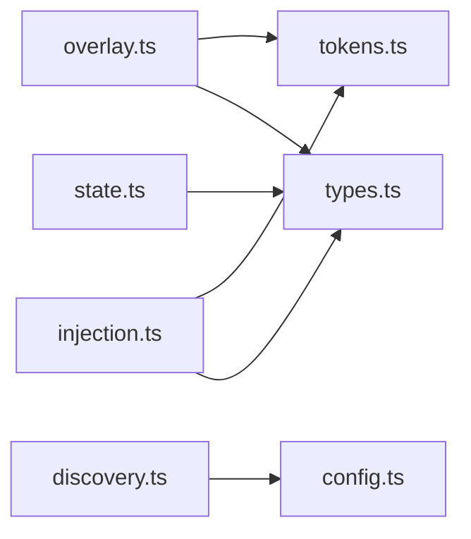

# MAINTAINING

How to keep this project's docs current as it evolves. Read once at the start of a development cycle; consult during the Release Procedure (see `ROADMAP.md`).

This file is meta-doc — added to the default `skipFiles` so it never auto-injects into CAPS context.

---

## Doc inventory

| File | Audience | Update trigger |
|---|---|---|
| `README.md` | End users on npm | New command shipped; config schema change; new troubleshooting case |
| `CHANGELOG.md` | Anyone reviewing a release | Every version bump — Added / Changed / Fixed / Security / Deprecated / Internal |
| `ROADMAP.md` | Future me, future Claude | When versioned plans change; mark shipped versions with ✅; refresh "Three Bets For Next Sprint" |
| `CONTEXT.md` | Anyone (especially Claude in future sessions) writing or reviewing code | New domain term introduced; existing term's scope changes |
| `CLAUDE.md` | Claude in future sessions | New command surface; testing state change; project boundary shift |
| `MAINTAINING.md` | The maintainer (you, me, future contributors) | Doc structure or release procedure changes |

---

## When to split into `docs/`

Stay with root markdown files until **any** of these triggers:

1. **`README.md` crosses ~400 lines** and can't be navigated without `Ctrl+F`
2. **User guide and reference diverge** — what users need on day 1 vs every config knob — and combining them confuses both audiences
3. **Multiple personas need different entry points** — e.g., "for pi extension authors" separate from "for CAPS users"
4. **You want a published site** with search, versioned docs, code highlighting

When any trigger fires, create `docs/` with this structure:

```
docs/
├── README.md           — index, points at the others
├── commands.md         — every command, every flag, examples
├── configuration.md    — config file schema with every field
├── architecture.md     — module map (src/*) + dependency graph
├── troubleshooting.md  — every "why isn't X working" case
└── images/             — screenshots, diagrams
```

`README.md` at the repo root then becomes ~50 lines: install line, one-paragraph pitch, link to `docs/`.

`MAINTAINING.md` moves into `docs/` at that point.

**Don't preemptively build docs infrastructure.** Tooling overhead doesn't pay off until the triggers fire.

---

## How to update each file

### `CHANGELOG.md`

Every release. Sections appear only when they have entries:

- **Added** — new features, commands, config fields
- **Changed** — behaviour shifts, default changes, renames
- **Fixed** — bug fixes (reference audit finding or issue number when relevant)
- **Security** — defensive limits, validation additions
- **Deprecated** — anything users should migrate away from
- **Internal** — refactors, test additions, CI changes — include only if visible outside this repo

Date in `YYYY-MM-DD`. Keep entries short. Link to commit hash if more detail useful.

Optional: keep an `## [Unreleased]` section between releases to accumulate notes — convert to versioned section on tag.

### `README.md`

When adding a command:
1. Row in `## Commands` table
2. If it takes flags/args worth detailing, brief subsection under it
3. If config schema changed, update `## Configuration` table
4. If it diagnoses a new failure mode, bullet in `## Troubleshooting`

Don't re-explain concepts already in `CONTEXT.md`. Link instead.

### `CONTEXT.md`

When introducing a new concept (a noun that appears 3+ times in code or design conversation):
1. Add entry: name, one-sentence definition, `_Avoid_` aliases
2. If it relates to existing terms, append to `## Relationships`
3. If users might confuse it with something explicitly out of scope, append to `## What this is NOT`

Term names: noun phrases, **bolded** when used as the term (e.g., **Skip List**, not "skip list"). Capitalised first letter.

### `CLAUDE.md`

- `# Commands` section: list every `/caps-*` command currently registered
- `# Testing` section: refresh test count + coverage state every release
- Boundaries (In/Out of scope): update if the project's reach changes

No implementation detail here — that's what code + `CONTEXT.md` are for.

### `ROADMAP.md`

- `## Status` table at top: tick shipped versions, surface next milestone
- Version section header: mark `✅ SHIPPED <YYYY-MM-DD>` after each release
- `# Three Bets For Next Sprint`: rewrite for the next milestone after every release
- `# Killed Ideas`: move rejected ideas here with reason
- **Don't delete history** — past plans are useful context

### Release Procedure

Lives in `ROADMAP.md` as the single source of truth. When you change *how* releases work, update there, not here.

---

## Screenshots

### When to take

- New overlay UI lands (`/caps` change, new sub-overlay)
- New diagnostic output worth showing (`/caps-doctor` formatted report, `/caps-prompt` preview)
- README's `[CAPS Context]` example block gets stale (commands renamed, output format changed)

### Where to store

- Before `docs/` split: at repo root as `screenshot-<feature>.png` (e.g., `screenshot-caps-overlay.png`)
- After `docs/` split: `docs/images/<feature>.png`

### How to take (Windows)

1. **Resize terminal** to fit the content without horizontal scroll — 90–110 columns is typical
2. **Capture** with Windows Snipping Tool (`Win+Shift+S`) or screen capture of choice
3. **Crop** to relevant content + 5–10px margin
4. **PNG, not JPEG** — text stays sharp
5. **Optional**: scale to a consistent display width (e.g., 800px wide) so README renders evenly across all screenshots

### How to embed

```markdown

```

Alt text matters — describes what the image shows for accessibility AND for when GitHub fails to render it.

### When to delete old screenshots

When the UI in the screenshot no longer matches the current UI. Stale screenshots mislead users more than missing screenshots.

---

## Diagrams

Generally not needed for this project. Add a diagram only when:

- A reader has asked "how does X relate to Y?" twice in PRs or issues
- The module dependency graph in `src/` becomes non-trivial (>10 modules, multi-hop deps)
- A sequence (lifecycle, state machine) takes more than 3 paragraphs to explain in prose

Use **Mermaid** (rendered natively by GitHub) for module graphs and sequence flows:

````markdown

````

Hand-drawn diagrams: not worth the maintenance burden for a solo project. Use code-as-source diagrams so they update with copy-paste rather than image regeneration.

---

## Doc rot — what to remove on every release

During Release Procedure step 2 (Doc sync), audit each file for:

- **Stale version refs** — "as of v2.0" pointing at long-passed versions
- **Stale TODO comments** — items that have shipped or been killed
- **Stale code in examples** — function signatures that changed, command flags that no longer exist
- **Dead links** — files moved, sections renamed
- **Tripwire reminders** — for tests that have been flipped (each version finds one or two)
- **Stale screenshots** — UI changes

Better to **delete** than to annotate with `<!-- removed in v2.1 -->`. Crufty comments accumulate. Git history holds the past.

---

## When this guide itself goes stale

If the docs no longer match this guide — e.g., we did move to `docs/` but the trigger criteria here said "wait too long" — **update this guide**. Don't preserve outdated guidance for the sake of consistency.

This file is mutable, not normative. Its job is to capture the current mental model so future-you (and future-Claude) doesn't have to re-derive it from scratch.
